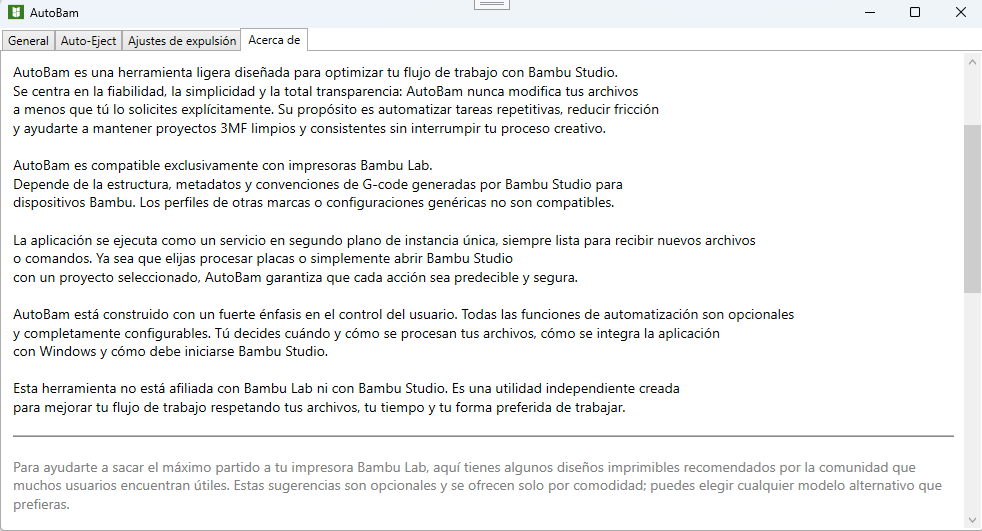

# AutoBam – ClickOnce Installer
A lightweight utility designed to improve the workflow when working with Bambu Studio.
This repository hosts the public ClickOnce installer for AutoBam.

## Features
Automates repetitive tasks

Keeps 3MF projects clean and consistent

Runs as a background service

Fully configurable

Designed exclusively for Bambu Lab printers

## Installation
Click the link below to install AutoBam using ClickOnce:

<a href="https://joseluisct.github.io/AutoBam/" target="_blank" style="font-size:18px; font-weight:bold;">
🚀 Install AutoBam
</a>

## Support

If you find AutoBam useful, you can support the project with a voluntary tip:

&nbsp;&nbsp;&nbsp;

## Notes
This repository does not contain the source code.
The full project is maintained in a private repository.

## Screenshot
Below is a preview of the AutoBam interface:

