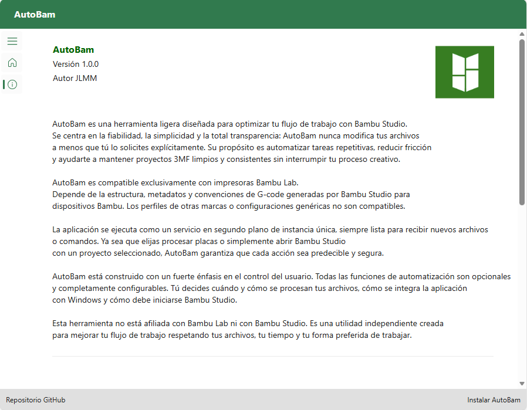

  

  
  
  
  
  

# AutoBam — Desktop Installer & Web Version
AutoBam is a lightweight workflow utility designed to streamline repetitive tasks when working with **Bambu Studio**. This repository hosts the **public installer** for the Windows desktop version and the **published WebAssembly build** of AutoBam. The application’s source code is private and not included here.

## ✨ Features
- Automates repetitive tasks
- Keeps 3MF projects clean and consistent
- Runs as a background service
- Fully configurable
- Designed exclusively for Bambu Lab printers

## 🚀 Installation

### **AutoBam Desktop (recommended — full feature set)** 
Install the Windows version using ClickOnce:

<a href="https://joseluisct.github.io/AutoBam/" target="_blank" style="font-size:18px; font-weight:bold;">
🚀 Install AutoBam
</a>

### **AutoBam Web (Blazor WebAssembly)**  
Runs directly in your browser. Ideal for quick access or non‑Windows devices. 

<a href="https://joseluisct.github.io/AutoBam/web" target="_blank" style="font-size:18px; font-weight:bold;">
🚀 Open AutoBam web
</a>

## 💬 Support
If you find AutoBam useful, you can support the project with a voluntary tip:

&nbsp;&nbsp;&nbsp;

## 🖼️ Screenshot

### AutoBam Desktop

  

### AutoBam Web

  

## 📺 Demo Video

  

## 🛠️ Technology
- .NET 10 
- Blazor WebAssembly 
- ClickOnce (Windows) 
- Hosted on GitHub Pages

## 🔒 Notes
- This repository does **not** contain the source code.
- The full project is maintained in a private repository.
